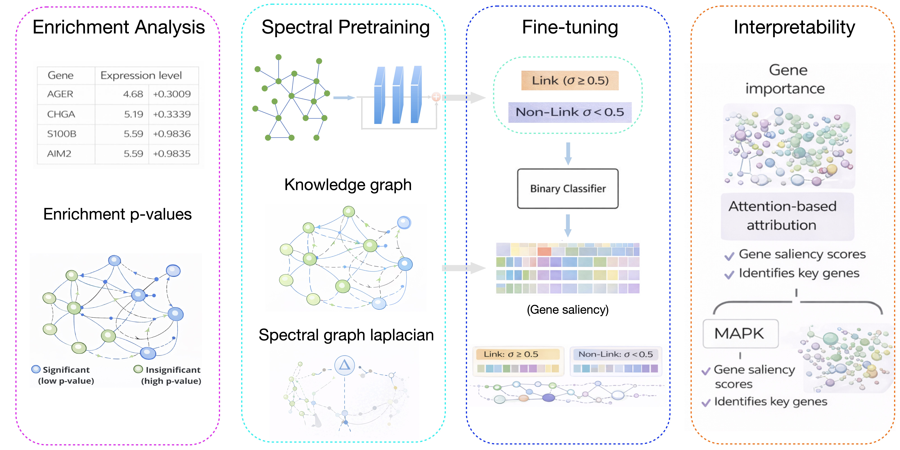

## A Spectral Graph Learning Framework for Pathway-Level Prediction and Explainability

This repository contains the code for our paper, "A Spectral Graph Learning Framework for Pathway-Level Prediction and Explainability".

## Data resources
The different dataset and KG used in this project are located in data directory. These files include:

-) The data about pathways from https://reactome.org/download/current/ReactomePathways.txt, relationships between pathways from https://reactome.org/download/current/ReactomePathwaysRelation.txt and pathway-protein relations from https://reactome.org/download/current/NCBI2Reactome.txt on 25 October, 2025.

-) The built knowledge graph including pathway-pathway and gene-pathway relationships.

## Setup

-) conda create -n gnn python=3.11 -y

-) conda activate gnn 

-) conda install pytorch::pytorch torchvision torchaudio -c pytorch

-) pip install pandas

-) pip install py2neo pandas matplotlib scikit-learn

-) pip install tqdm

-) conda install -c dglteam dgl

-) pip install seaborn

## Get start
## creating embedding
python GKGL-PE/embedding_clustering/gat_embedding.py --in_feats 128 --out_feats 128 --num_layers 4 --num_heads 1 --batch_size 1 --lr 0.01 --num_epochs 200
## link prediction
python GKGL-PE/embedding_clustering/main.py --out-feats 128 --num-heads 4 --num-layers 6 --lr 0.02 --input-size 2 --hidden-size 16 --feat-drop 0.1 --attn-drop 0.1 --epochs 200
