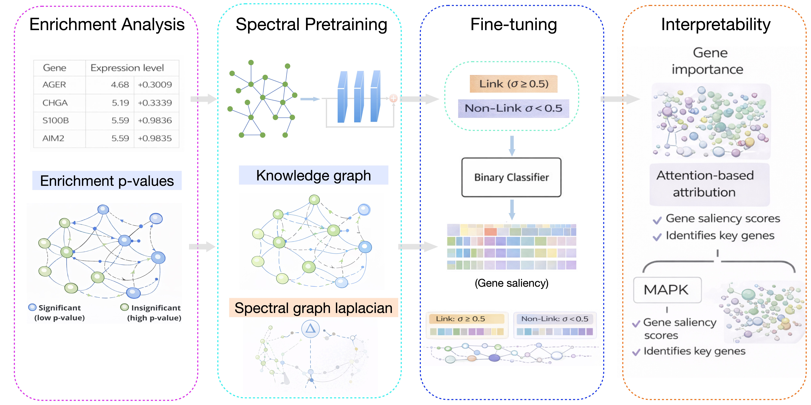

## A Spectral Graph Learning Framework for Pathway-Level Prediction and Explainability

This repository contains the code for our paper, "A Spectral Graph Learning Framework for Pathway-Level Prediction and Explainability".

## Data Source

The dataset is obtained from the following sources:

- **[reactome pathway database](https://reactome.org/)**  

REACTOME is an open-source, open access, manually curated and peer-reviewed pathway database.

The different dataset and KG used in this project are located in data directory. These files include:

-) The data about pathways from https://reactome.org/download/current/ReactomePathways.txt, relationships between pathways from https://reactome.org/download/current/ReactomePathwaysRelation.txt and pathway-protein relations from https://reactome.org/download/current/NCBI2Reactome.txt on 25 October, 2025.

-) The built knowledge graph including pathway-pathway and gene-pathway relationships.

## Setup and Get Started

1. Install the required dependencies:
   - `pip install -r requirements.txt`

2. Activate your Conda environment:
   - `conda activate gnn`

3. Install PyTorch:
   - `conda install pytorch torchvision torchaudio -c pytorch`

4. Install the necessary Python packages:
   - `pip install pandas`
   - `pip install py2neo pandas matplotlib scikit-learn`
   - `pip install tqdm`
   - `pip install seaborn`

5. Install DGL:
   - `conda install -c dglteam dgl`

6. Download the data from the built gene association graph using the link below and place it in the `data` directory before training:
   - [Download KG](https://drive.google.com/file/d/1riKXWv0eMa86jgAZkuFW7masb0BJ_oS4/view?usp=drive_link)

7. To train the model, run the following command:
   - `python main.py --num-layers 6 --lr 0.001 --input-size 2 --hidden-size 16 --epochs 100`